# BatteryDataEngineering

## Steps

1. Import different data sets and provide metadata and description of the datasets.
2. Ingest data into Databricks cloud

## Data Samples

### NASA

- Discharge

| VoltageMeasured |	CurrentMeasured |	TemperatureMeasured	| CurrentLoad	| VoltageLoad	| Duration |	
| --------------- | --------------- | ------------------- | ----------- | ----------- | -------- |
| 4.246764125510136 |	-0.0014110647362388163 | 6.234018870000787 |	0.0002 | 4.262 | 9.36	|

- Charge

| VoltageMeasured	| CurrentMeasured	| TemperatureMeasured	| CurrentCharge	| VoltageCharge	| Duration |	
| --------------- | --------------- | ------------------- | ------------- | ------------- | -------- |
| 3.746592135437914 |	1.4890569689379058 | 5.9925280590812635	| 1.4995 | 4.618 | 2.594000000000001 |

- Impedance

| SenseCurrent | BatteryCurrent | CurrentRatio | BatteryImpedance | RectifiedImpedance |
| ------------ | -------------- | ------------ | ---------------- | ------------------ | 
| ( (929.0427856445312-49.546653747558594j) | (227.34068298339844-68.11133575439453j) | (3.8098847365794053+0.9235024808405093j) | (0.22133620478684887+0.04668101354100503j) |	(0.17505020080728648-0.019801974566721604j)	) |

```mermaid
graph LR;
classDef silverBlock fill:#C0C0C0,stroke:#000000,stroke-width:2px
classDef bronzeBlock fill:#CD7F32,stroke:#000000,stroke-width:2px
classDef goldBlock fill:#FFD700,stroke:#000000,stroke-width:2px
classDef dataBlock fill:#85C1E9,stroke:#000000,stroke-width:2px
classDef deltaBlock fill:#85C1E9,stroke:#000000,stroke-width:2px
classDef viewBlock fill:#85C1E9
classDef sparkdfBlock fill:#7FFFD4
classDef title fill:#FFFFFF
A["<img src='https://cdn3.iconfinder.com/data/icons/bigdata-1/128/bigdata-Color-16-512.png'; width='170' />" <br/>ON-PREMISE Sources: <br/>]
A --> I{"![aa](https://cdn3.iconfinder.com/data/icons/server-rack/64/cloud-512.png)" <br/> Ingestion}
I --> B1[("<img src='https://delta.io/static/3bd8fea55ff57287371f4714232cd4ef/f3063/delta-lake-logo.png'; width='40' />" <br/> Bronze Table 1)]
I --> B2[("<img src='https://delta.io/static/3bd8fea55ff57287371f4714232cd4ef/f3063/delta-lake-logo.png'; width='40' />" <br/> Bronze Table 2)]
I --> B3[("<img src='https://delta.io/static/3bd8fea55ff57287371f4714232cd4ef/f3063/delta-lake-logo.png'; width='40' />" <br/> Bronze Table 3)]
B1 --> E{"<img src='https://cdn3.iconfinder.com/data/icons/big-data-2-4/504/Data-cleaning-broom-dusting-delete-256.png'; width='130' />" <br/>Data Cleaning}
B2 --> E
B3 --> E
E --> S1[("<img src='https://delta.io/static/3bd8fea55ff57287371f4714232cd4ef/f3063/delta-lake-logo.png'; width='40' />" <br/> Silver Table 1)]
E --> S2[("<img src='https://delta.io/static/3bd8fea55ff57287371f4714232cd4ef/f3063/delta-lake-logo.png'; width='40' />" <br/> Silver Table 2)]
E --> S3[("<img src='https://delta.io/static/3bd8fea55ff57287371f4714232cd4ef/f3063/delta-lake-logo.png'; width='40' />" <br/> Silver Table 3)]
S1 --> P{"<img src='https://cdn3.iconfinder.com/data/icons/procurement-process-2/100/three_way_matching_process_warehouse_purchase_requisition-512.png'; width='130' />" <br/> Matching Algorithm</br>/Entity Resolution}
S2 --> P
S3 --> P
P --> CLS{"<img src='https://cdn4.iconfinder.com/data/icons/artificial-intelligence-line-filled/123/Big_Data__Analysis__clustering__data__process__system-512.png'; width='130' />" <br/> Cluster Attribution}
CLS --> S4[("<img src='https://delta.io/static/3bd8fea55ff57287371f4714232cd4ef/f3063/delta-lake-logo.png'; width='40' />" <br/> Silver Table 4)]
CLS --> S5[("<img src='https://delta.io/static/3bd8fea55ff57287371f4714232cd4ef/f3063/delta-lake-logo.png'; width='40' />" <br/> Silver Table 5)]
CLS --> S6[("<img src='https://delta.io/static/3bd8fea55ff57287371f4714232cd4ef/f3063/delta-lake-logo.png'; width='40' />" <br/> Silver Table 6)]
S4 --> SBI{"<img src='https://cdn0.iconfinder.com/data/icons/flat-design-database-set-4/24/table-field-256.png'; width='130' />" <br/> Select Best Info</br>/Conflict Handling}
S5 --> SBI
S6 --> SBI
SBI --> Q[("<img src='https://delta.io/static/3bd8fea55ff57287371f4714232cd4ef/f3063/delta-lake-logo.png'; width='40' />" <br/> Gold Table)] 
Q --> GEMS[("<img src='https://cdn1.iconfinder.com/data/icons/business-and-management-56/24/IP_01_-_Business_and_Management-14-256.png'; width='80' />" <br/> GEMS)]
class T title
class S1 silverBlock
class S2 silverBlock
class S3 silverBlock
class S4 silverBlock
class S5 silverBlock
class S6 silverBlock
class B1 bronzeBlock
class B2 bronzeBlock
class B3 bronzeBlock
class TEMP dataBlock
class X sparkdfBlock
class Y sparkdfBlock
class Z viewBlock
class SD sparkdfBlock
class Q goldBlock
class GEMS goldBlock;
```

